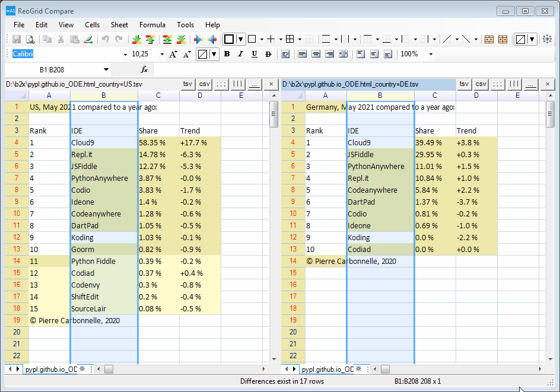

# ReoGrid

Fast and powerful open source .NET spreadsheet component

https://reogrid.net

# Documentations

https://reogrid.net/document

# Snapshots

Read from Excel 

Print Settings 

Charts 

Cells Freeze 

Cell Types and Controls 

Group and Outline 

Custom Control Appearance 

Script and Macro Execution 

ReoGrid Compare performing Align by LCS 

*The data in this example is from [TOP ODE index](https://pypl.github.io/ODE.html), © Pierre Carbonnelle, 2020, License: [CC BY 3.0](https://creativecommons.org/licenses/by/3.0/)*

# License

MIT License

Copyright (c) Jingwood & unvell.com 2012-2019, All rights reserved.

